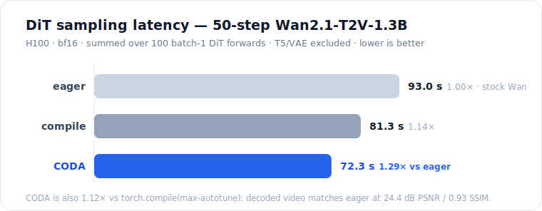

<h1 align="center">CODA-Wan-DiT</h1>

<p align="center">
  <b>Applying <a href="https://arxiv.org/abs/2605.19269">CODA</a> GEMM-epilogue fusion to the Wan2.1 video diffusion transformer.</b><br>
  <b>1.29× faster DiT sampling than stock Wan — same video, less memory.</b>
</p>

<p align="center">
  <i>A study, not a product. Numbers are honest, including where CODA doesn't help.</i>
</p>

---

## Same prompt, same seed — stock Wan vs CODA

<table>
<tr>
<td align="center"><b>Stock Wan (eager)</b></td>
<td align="center"><b>CODA (this repo)</b></td>
</tr>
<tr>
<td align="center"></td>
<td align="center"></td>
</tr>
<tr>
<td align="center">93.0 s of DiT / 50 steps</td>
<td align="center"><b>72.3 s of DiT — 1.29× faster</b></td>
</tr>
</table>

<p align="center"></p>

---

## Results

Full 50-step Wan2.1-T2V-1.3B generation, same prompt / seed / noise, 832×480×81, UniPC, CFG 5.0, H100, bf16.
Latency is **DiT-only** (T5 encode + VAE decode excluded), summed over all 100 batch-1 DiT forwards, median of 3 runs.

| Variant | DiT latency (50 steps) | per step | vs eager | vs compile | denoise peak mem |
|---|---:|---:|---:|---:|---:|
| eager (stock Wan) | 93,046 ms | 1,861 ms | 1.000× | 0.873× | 5.18 GiB |
| `torch.compile(max-autotune)` | 81,273 ms | 1,625 ms | 1.145× | 1.000× | 4.49 GiB |
| **CODA** | **72,339 ms** | **1,447 ms** | **1.286×** | **1.124×** | 4.93 GiB |

**Quality** (all 81 decoded frames, CODA vs eager): global PSNR **24.40 dB**, mean SSIM **0.928**. High structural similarity — not claimed pixel-identical (50 sampling steps accumulate small bf16 differences).

> Report the `vs compile` number as the honest headline. `vs eager` is larger partly because Wan's eager 3D-RoPE is slow and `torch.compile` alone already recovers much of it. See [`docs/end_to_end.md`](docs/end_to_end.md).

---

## What this is

A learning outcome of studying **CODA: Rewriting Transformer Blocks as GEMM-Epilogue Programs**, applied to a real video DiT.

**The idea in one sentence:** a Transformer block is a few GEMMs surrounded by memory-bound side-ops (norm, activation, residual, gating, RoPE); CODA rewrites those side-ops so they run inside the neighbouring GEMM's *epilogue* — while the output tile is still on-chip — instead of round-tripping the whole `[N, d]` activation through HBM. **Attention stays FlashAttention and is not touched.**

On Wan's block, this absorbs the adaLN modulation, gating, residuals, GELU, LayerNorm, QK-RMSNorm and 3D-RoPE around the 5 non-attention GEMMs into their epilogues, then per-shape-tunes the GEMMs and prepacks weights with zero-copy aliasing.

📖 **The full story is in the docs** — the stock-Wan-block → CODA mapping, the algebra, why the biggest structural fusion *fails* on a DiT, and honest ceilings:

- [**`docs/walkthrough.md`**](docs/walkthrough.md) — narrative deep-dive: what the optimization is and why
- [**`docs/end_to_end.md`**](docs/end_to_end.md) — the full 50-step video experiment (this page's numbers)
- [**`docs/report.md`**](docs/report.md) — the single-forward microbenchmark: five-bucket profiling, per-lever gates

---

## Reproduce

**Requires** a Hopper GPU (H100/H200), CUDA ≥ 12.4, PyTorch ≥ 2.7, [CuTeDSL/CUTLASS](https://github.com/NVIDIA/cutlass), [coda-kernels](https://github.com/HanGuo97/coda-kernels) (the `rapier.*` / `kernels.*` packages), [Wan2.1](https://github.com/Wan-Video/Wan2.1) + the T2V-1.3B checkpoint, Triton, and FlashAttention-2.

```bash
# Full video generation, DiT-only timing — one entry, three variants:
python generate_video.py --variant eager   --ckpt-dir /path/to/Wan2.1-T2V-1.3B --output-dir out/
python generate_video.py --variant compile  --ckpt-dir /path/to/Wan2.1-T2V-1.3B --output-dir out/
python generate_video.py --variant coda     --ckpt-dir /path/to/Wan2.1-T2V-1.3B --output-dir out/

# Isolated single-DiT-forward microbenchmark:
python coda_wan/run_wan_coda.py --variant coda --model-dir /path/to/Wan2.1-T2V-1.3B --output out.json
```

This is a reference implementation, not a drop-in package — the kernels need the CODA / CuTeDSL / Rapier stack and a Hopper GPU.

---

## Layout

```
coda_wan/
  wan_coda_kernels.py         # K1 (FFN GELU epilogue) + K3 (QK RMSNorm+RoPE) + zero-copy weight prepack
  wan_gate_residual_coda.py   # K2 / E gate+bias+residual GEMM epilogues (CuTeDSL / Rapier EVT)
  run_wan_coda.py             # single-forward eager/compile/coda A/B + CodaFullBlock
generate_video.py             # full-pipeline video generation with DiT-only timing
docs/                         # walkthrough, end-to-end experiment, microbenchmark report
results/full-video/           # result JSONs, GIFs, MP4s, aligned frames, checksums
assets/                       # figures
```

---

## Limitations

Sampling-only, bf16, forward-only (no training/FP8). Numbers are shape-specific (H100, `N=32760`, batch 1) — any change to resolution / frames / batch / model requires re-profiling. Video quality is structural-similar, not pixel-identical.

## Credits & license

- **CODA** — Guo, Zhang, Menon, Guessous, Thakkar, Kim, Dao (2026). [arXiv:2605.19269](https://arxiv.org/abs/2605.19269) · [coda-kernels](https://github.com/HanGuo97/coda-kernels)
- **Wan2.1** — Alibaba Wan Team. [Wan-Video/Wan2.1](https://github.com/Wan-Video/Wan2.1) (Apache-2.0)
- **CUTLASS / CuTeDSL** — NVIDIA

Fusion code in this repo is [Apache-2.0](LICENSE). It depends on, but does not vendor, the CODA and Wan2.1 codebases — install those from upstream under their own licenses. An independent study for learning purposes.
